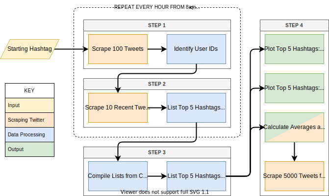

# Automated Method to Find Top Hashtags for a Group

## Reproducibility

To install the python environment and run the code, follow these steps:

1. [Install Conda](https://conda.io/projects/conda/en/latest/user-guide/install/index.html).
2. Create a Conda environment using the `environment.yml` file by following [these steps](https://conda.io/projects/conda/en/latest/user-guide/tasks/manage-environments.html#creating-an-environment-from-an-environment-yml-file).
3. Activate the Conda environment with `conda activate twitter_hashtag_analysis`.
4. Make the main script executable with `chmod +x run.sh`.
5. Run the main script with `./run.sh`.

To later deactivate the Conda environment, run `conda deactivate`.

## Data Collection Diagram

## Data Analysis Diagram
.drawio.svg)

